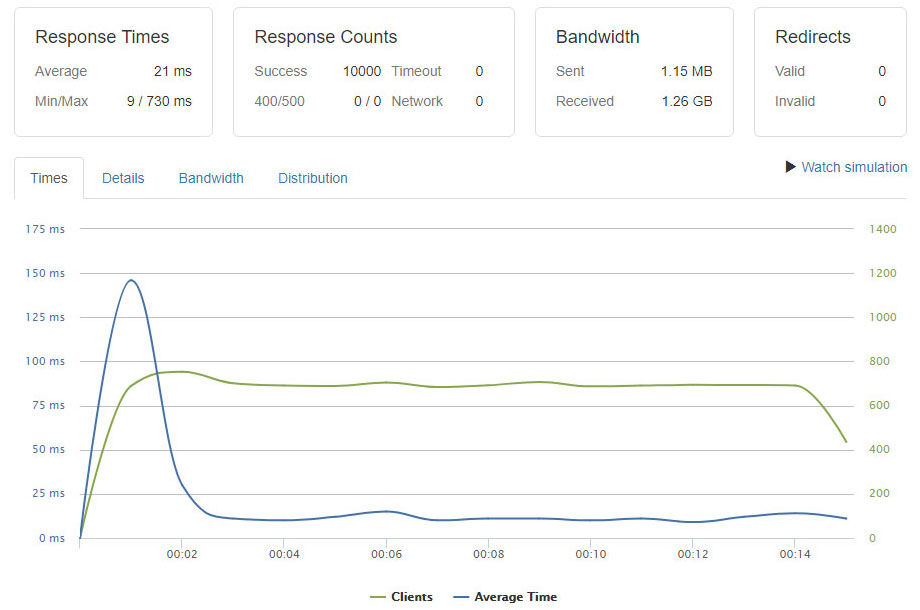
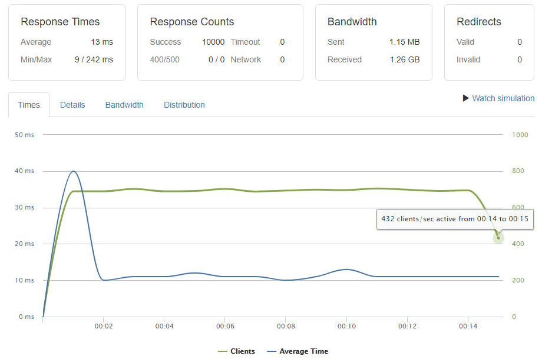

# loadtest

It's basically testing Dart and it's frameworks over [Loader](https://loader.io/), other implementations are here for reference.

### 2 GB Memory / 2 vCPUs / Ubuntu 16.04.4 x64

#### Dart (await for)

#### Isolates (await for)

#### Isolates (listen)

#### Angel

#### Aqueduct

#### Jaguar

#### Shelf

